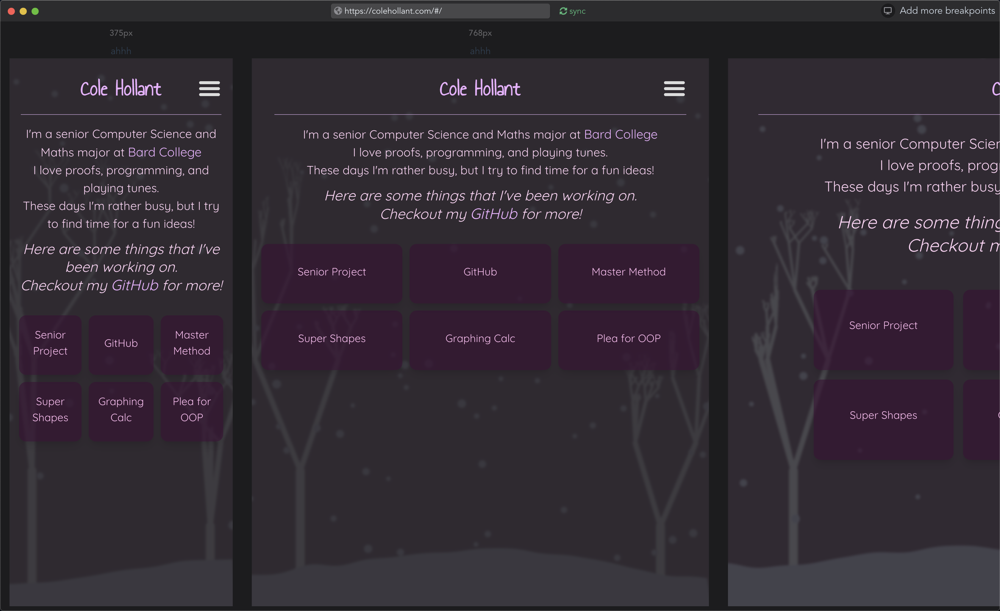

# mq-viewer

WIP: This is a little app to help look at sites across different viewports. Sorta like a lightweight [sizzy](https://sizzy.co/)-clone.

## Features

- [ ] url bar
  - [X] visit site by url
  - [X] update based on page nav
  - [X] search engine integration
  - [ ] history
  - [ ] bookmarks?
  - [ ] maaaaybe tabs
- [ ] device sync
  - [X] url sync
  - [ ] scroll sync
  - [ ] find element?
- [X] widths
  - [X] render multiple widths
  - [X] new device form
  - [X] default widths
- [ ] height support?

## Screenshot

